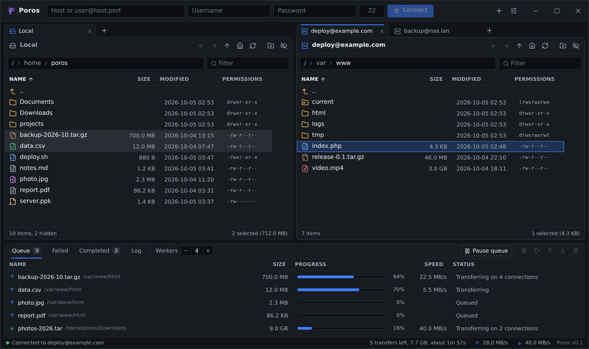
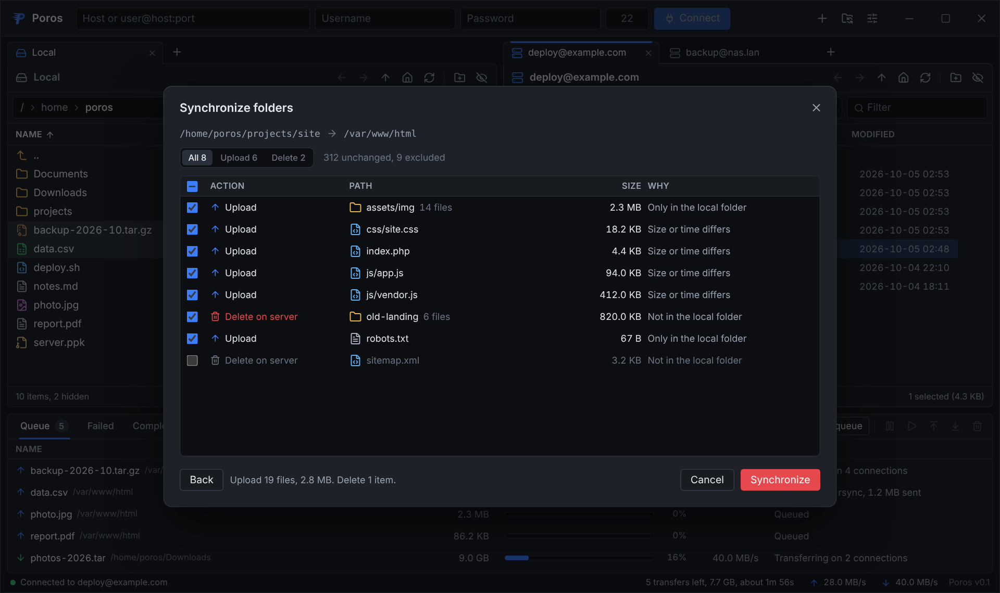

<p align="center">
  
</p>

<h1 align="center">Poros</h1>

<p align="center">
  A fast, keyboard-friendly SFTP and rsync client for Linux and Windows.
</p>

<p align="center">
  <a href="https://github.com/khaodius/poros/actions/workflows/ci.yml"></a>
  <a href="LICENSE"></a>
</p>



It is a native desktop app built with
[Tauri](https://tauri.app): the interface is TypeScript and React, and everything that touches
the network or the disk is Rust.

## Features

- **Tabs and docking**: every local folder and server session is a tab. Drag tabs to reorder
  them, or onto another tab bar to join it. Pull a tab off its bar and its pane follows the
  pointer; once it covers half of another pane, the panes move aside to open the spot it will
  drop into, beside that pane or in its place. Moving a pane does not reload it. Drag the
  dividers to resize, and pull a tab out of the window to give it a window of its own, then send
  it back from its menu.
- **Transfer queue** with parallel workers, each on its own connection, and a worker count you
  can change from the queue header while transfers run; holding **-** or **+** counts faster
  every ten steps, as do the number fields in settings. Large files are split across idle
  connections. Pause, resume, reorder, retry and remove transfers; failed and completed transfers
  have their own lists. Upload and download speeds sit beside the version in the status bar.
- **Folder sync** in the manner of rsync: compare a local folder with a server folder one way or
  both ways, by size and modification time, size alone or contents, with rsync-style exclude
  patterns. A preview lists every upload, download, deletion and conflict before anything changes,
  and you untick whatever should be left alone. See
  [Synchronizing folders](#synchronizing-folders).
- **rsync delta transfers**: when a file you copy already exists on the other side, only the parts
  that changed cross the network, in both directions. Poros speaks the rsync protocol itself over
  its own SSH connection, so nothing needs installing on your computer, Windows included. Servers
  without rsync get the whole file over SFTP as before.
- **Drag and drop** between a local and a server tab, onto a folder row to land inside it, or
  from your file manager onto a server tab. The strip right of the last column belongs to no row,
  so dropping there always lands in the folder on show.
- **Saved connections** with name, host, port, user, authentication method, key file and remote
  folder. Passwords and passphrases are only kept if you ask, and then in the system keychain,
  never in a file.
- **Settings** for simultaneous transfers, connections per file, upload and download limits,
  request size and requests in flight, TCP socket buffers (auto-tuned or fixed), what to do when a
  file exists, timestamps and permissions, retries, timeouts, keepalives, compression, delta
  transfers, folder sync defaults, and the log.
- **Themes** as JSON files anyone can write and share, ten built in, and a picker in settings for
  every color, down to the top bar, scrollbars, progress bars and striped rows. See
  [Themes](#themes).
- **Appearance** settings for the interface font and the monospace font, picked from the fonts
  installed on your computer with good screen fonts suggested first, plus text size, corner
  roundness, file list row height and striped rows.
- **Every common key format**, including the ones other clients choke on:
  - OpenSSH, PEM (PKCS#1) and PKCS#8 private keys, encrypted or not.
  - PuTTY `.ppk` files, version 2 and 3, encrypted (Argon2id, Argon2i, Argon2d) or not, with
    RSA, Ed25519 and ECDSA keys.
  - Files mangled by Windows editors or mail clients: byte order marks, CRLF line endings,
    stray blank lines and stripped comment spaces are repaired before parsing.
  - A clear "wrong passphrase" message instead of a generic failure.
- **SSH agents**: `SSH_AUTH_SOCK` on Linux, and the OpenSSH Authentication Agent service or
  Pageant on Windows.
- **Password and keyboard-interactive** authentication.
- **Host key verification** that reads your existing `~/.ssh/known_hosts` (hashed entries,
  wildcards, `@revoked` markers and non-standard ports included) and asks before trusting a new
  or changed key. Poros never writes to your OpenSSH files.
- **File browsing and management** on both sides: breadcrumbs, a typed path bar, history,
  filtering, hidden files, new folder, rename, recursive delete with confirmation and copy path.
  Sort by name, size, type, date, permissions or owner, with folders on top or mixed in; sorting
  by type keeps names A to Z within each type. Right-click a column heading to show or hide
  columns. Lists are virtualized, so large folders stay responsive.
- **Symlink aware**: links to folders can be opened, broken links are marked.
- **Activity log** with server banners and every operation, filterable by level, session and
  text, and savable to a file.
- **Native on Linux and Windows**, including Wayland sessions, Windows drive letters and UNC
  paths. The top bar doubles as the title bar; settings can bring back the system one.

## Install

Prebuilt installers are attached to each [release](https://github.com/khaodius/poros/releases)
once one is published:

| Platform | Packages                    |
| -------- | --------------------------- |
| Windows  | `.msi`, `-setup.exe`        |
| Linux    | `.deb`, `.rpm`, `.AppImage` |

Every CI run also uploads installers as build artifacts.

### Upgrading

Run the newer package over the old one; there is no need to uninstall first. Upgrades never touch
the app's data folder (see [Where Poros keeps its data](#where-poros-keeps-its-data)).

- **Windows setup**: when it finds an older Poros, it asks once and then upgrades in place with
  only a progress window. It closes Poros if it is running, keeps the install folder and shortcuts,
  and starts the new version when it finishes. Running it over the same or a newer version opens
  the regular setup wizard.
- **Windows MSI**: replaces the older version automatically.
- **Linux**: install the new package with your package manager, for example
  `sudo apt install ./Poros_0.2.0_amd64.deb` or `sudo dnf install ./Poros-0.2.0-1.x86_64.rpm`.
  For the AppImage, replace the file.

## Build from source

You need [Node.js](https://nodejs.org) 22 or newer and [Rust](https://rustup.rs) 1.88 or newer.

### Linux

Install the WebKitGTK development packages first.

Debian and Ubuntu:

```sh
sudo apt install build-essential curl wget file libwebkit2gtk-4.1-dev \
  libayatana-appindicator3-dev librsvg2-dev libssl-dev libxdo-dev
```

Fedora:

```sh
sudo dnf install webkit2gtk4.1-devel openssl-devel curl wget file \
  libappindicator-gtk3-devel librsvg2-devel libxdo-devel
sudo dnf group install c-development
```

Arch Linux:

```sh
sudo pacman -S --needed webkit2gtk-4.1 base-devel curl wget file openssl \
  appmenu-gtk-module libappindicator-gtk3 librsvg xdotool
```

### Windows

Install the [Microsoft C++ Build Tools](https://visualstudio.microsoft.com/visual-cpp-build-tools/)
with the "Desktop development with C++" workload. WebView2 ships with Windows 10 and 11.

### Run and package

```sh
git clone https://github.com/khaodius/poros.git
cd poros
npm ci
npm run tauri dev      # run with hot reload
npm run tauri build    # installers in src-tauri/target/release/bundle
```

## Usage

Type a host into the bar at the top and press Enter. It accepts `host`, `user@host`,
`user@host:port` and `sftp://user@host:port/path`. The **+** button at the top right opens the
connection dialog for key files, SSH agents and saved connections, the button beside it
synchronizes folders, and the last one opens settings. The **+** at the end of a tab bar opens a
new tab with your saved connections.

To transfer, drag files from a local tab to a server tab or the other way, or right-click them and
choose **Upload** or **Download**. Double-clicking a file sends it to the other side too; settings
can turn that off.

The first time you connect to a server, Poros shows its key fingerprint. Choose **Trust and
connect** to remember it, or **Connect once** to trust it for this session only.

### Synchronizing folders



Open **Synchronize folders** with its button at the top right, or right-click a folder and choose
**Synchronize folder...**. Pick the local folder, the server and its folder, and a direction:

- **Local to server** makes the server folder match the local one, and **Server to local** does
  the reverse. Either can also delete what the target has and the source does not.
- **Both ways** copies what is missing on either side; where both sides have a file, the newer one
  wins. Files that differ but carry the same time are listed as conflicts for you to settle.

**Compare** lists both folders and shows what would change, without changing anything. Untick
items to leave them alone, pick a side for each conflict, then press **Synchronize**. Deletions
and new folders happen at once, and files join the transfer queue. Comparing by contents reads
every file that has the same size on both sides, using `md5sum` on the server when it has one.

Exclude patterns work as in rsync: `*.log` skips matching names anywhere, `cache/` skips folders
named `cache`, `/build` skips only the `build` at the top, and `**` matches across folders.

Delta transfers apply to every upload and download that overwrites a file, synchronized or not.
They need rsync 2.6.4 or newer on the server, and are tuned in Settings > Sync: the smallest file
they are used for, and the rsync command for servers where it is not on the `PATH`.

### Keyboard

| Keys                                    | Action                  |
| --------------------------------------- | ----------------------- |
| Up, Down, Page Up, Page Down, Home, End | Move                    |
| Shift + movement                        | Extend the selection    |
| Ctrl + click, Shift + click             | Toggle, select a range  |
| Ctrl + A                                | Select all              |
| Enter                                   | Open folder             |
| Backspace, Alt + Up                     | Parent folder           |
| Alt + Left, Alt + Right                 | Back, forward           |
| F5, Ctrl + R                            | Refresh                 |
| F2                                      | Rename                  |
| F7, Ctrl + Shift + N                    | New folder              |
| Delete                                  | Delete                  |
| Ctrl + L                                | Type a path             |
| Ctrl + F                                | Filter                  |
| Tab                                     | Move to the next pane   |
| Letters                                 | Jump to a matching name |
| Escape                                  | Clear the selection     |
| Ctrl + T                                | New tab                 |
| Ctrl + W, middle click on a tab         | Close the tab           |
| Ctrl + ,                                | Settings                |
| Ctrl + =, Ctrl + -, Ctrl + mouse wheel  | Larger, smaller text    |
| Ctrl + 0                                | Default text size       |

### Where Poros keeps its data

Everything lives in the app's config folder:

- Linux: `~/.config/io.github.khaodius.poros/`
- Windows: `%APPDATA%\io.github.khaodius.poros\`

| File               | Contents                             |
| ------------------ | ------------------------------------ |
| `settings.json`    | Settings                             |
| `connections.json` | Saved connections, without passwords |
| `known_hosts`      | Host keys you chose to trust         |
| `themes/`          | Theme files                          |

Passwords and passphrases you choose to remember are stored in the system keychain (Secret
Service on Linux, Credential Manager on Windows) under the service name `io.github.khaodius.poros`.

### Themes

A theme is a JSON file in the `themes` folder; **Open themes folder** in Settings > Appearance
takes you there, and **Import theme file** copies one in. Poros rereads the folder whenever its
window gets focus, so edits made in a text editor apply when you switch back. Editing a color in
settings writes to the active theme file, and editing a built-in theme saves a copy of it first.

```json
{
  "name": "Plum",
  "base": "dark",
  "colors": {
    "accent": "#8a63e6",
    "surface-base": "#141219",
    "surface-raised": "#1b1822",
    "text": "#ebe7f3"
  },
  "fonts": { "ui": "Inter, sans-serif", "mono": "JetBrains Mono, monospace" },
  "radius": 6
}
```

- `base` is `dark`, `light` or `system` and supplies every color the theme leaves out.
- `colors` takes hex (`#rgb`, `#rrggbb`, with or without alpha) or `rgb()` and `hsl()` values.
  Hover and tint colors follow `accent` and `danger` unless set. Keys:
  - Accent: `accent`, `accent-hover`, `accent-soft`, `accent-softer`, `text-on-accent`
  - Surfaces: `surface-base`, `surface-raised`, `surface-sunken`, `surface-overlay`,
    `surface-hover`, `surface-pressed`
  - Borders: `border`, `border-strong`, `border-focus`
  - Text: `text`, `text-muted`, `text-faint`
  - Status: `danger`, `danger-hover`, `danger-soft`, `warning`, `success`
  - File icons: `icon-folder`, `icon-image`, `icon-video`, `icon-audio`, `icon-archive`,
    `icon-data`, `icon-key`, `icon-code`, `icon-text`, `icon-file`
  - Window: `titlebar`, `statusbar`, `list-header`, `pane-border-active`, `tab-indicator`,
    `backdrop`
  - Lists: `row-selected`, `row-selected-inactive`, `row-hover`, `row-alternate`, `scrollbar`,
    `scrollbar-hover`
  - Transfers: `progress`, `upload`, `download`
- `fonts.ui` and `fonts.mono` are CSS font lists.
- `radius` is the corner radius in pixels, from 0 to 16.

Fonts and corner roundness picked in Settings > Appearance take the place of the theme's.

Unknown keys and invalid values are ignored and listed under the theme in settings.

### Wayland

Poros sets `WEBKIT_DISABLE_DMABUF_RENDERER=1` and `__NV_DISABLE_EXPLICIT_SYNC=1` at startup,
which avoids blank windows and protocol errors on some Wayland compositors and NVIDIA drivers.
Set either variable yourself to override it.

## Development

```sh
npm run lint && npm run format:check && npm run typecheck && npm test
cd src-tauri
cargo fmt --check
cargo clippy --all-targets -- -D warnings
cargo test
```

CI runs all of the above on Linux and Windows and builds installers for both.

### End-to-end tests

`src-tauri/tests/sftp_server.rs` connects to a real OpenSSH server and is skipped unless
`POROS_TEST_SSH_PORT` is set. It expects a server on `127.0.0.1` with rsync installed that accepts
the user `POROS_TEST_SSH_USER` (default `poros`) with the password `POROS_TEST_SSH_PASSWORD`
(default `poros-pass`) and every key in `src-tauri/tests/fixtures/keys/*.pub`. A throwaway server
on Linux:

```sh
sudo useradd --create-home poros && echo 'poros:poros-pass' | sudo chpasswd
sudo -u poros mkdir -p /home/poros/.ssh /home/poros/data
cat src-tauri/tests/fixtures/keys/*.pub | sudo -u poros tee /home/poros/.ssh/authorized_keys >/dev/null
sudo chmod 600 /home/poros/.ssh/authorized_keys

mkdir -p /tmp/poros-sshd
sudo ssh-keygen -q -t ed25519 -N '' -f /tmp/poros-sshd/host_ed25519
cat > /tmp/poros-sshd/sshd_config <<EOF
Port 2222
ListenAddress 127.0.0.1
HostKey /tmp/poros-sshd/host_ed25519
PidFile /tmp/poros-sshd/sshd.pid
PasswordAuthentication yes
UsePAM no
Subsystem sftp internal-sftp
EOF
sudo mkdir -p /run/sshd && sudo /usr/sbin/sshd -f /tmp/poros-sshd/sshd_config

cd src-tauri && POROS_TEST_SSH_PORT=2222 cargo test
```

Test keys are encrypted with the passphrase `poros-test`.

## License

[Apache License 2.0](LICENSE)
